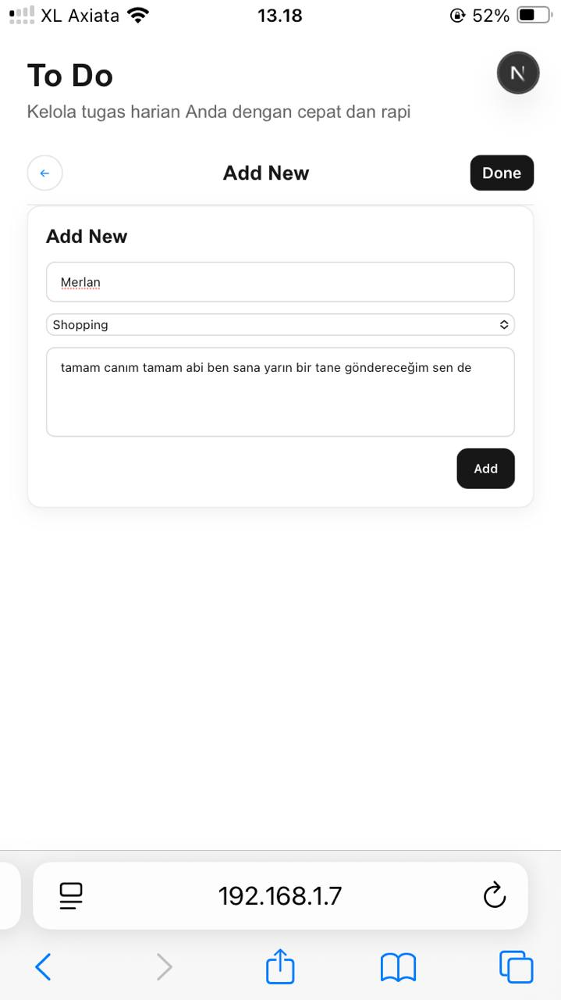
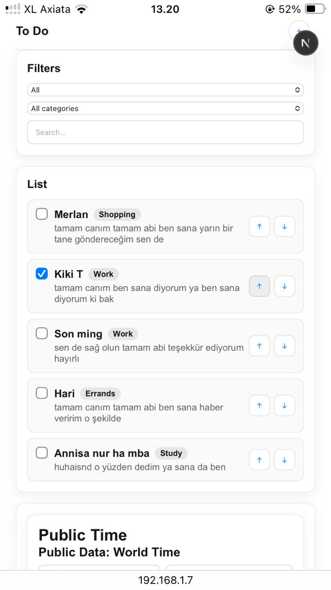
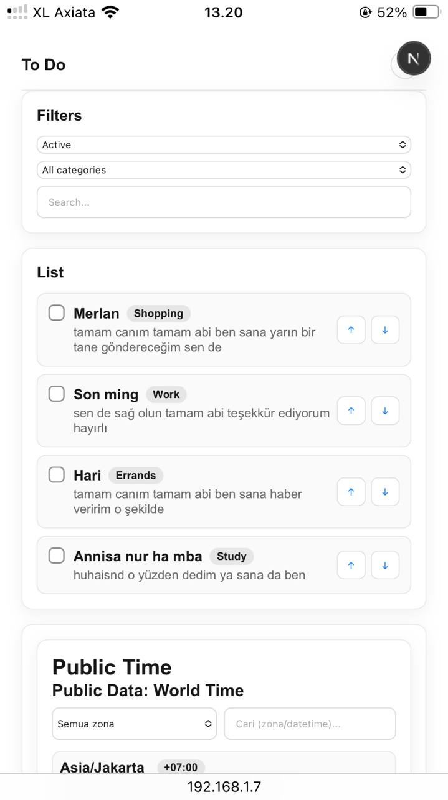
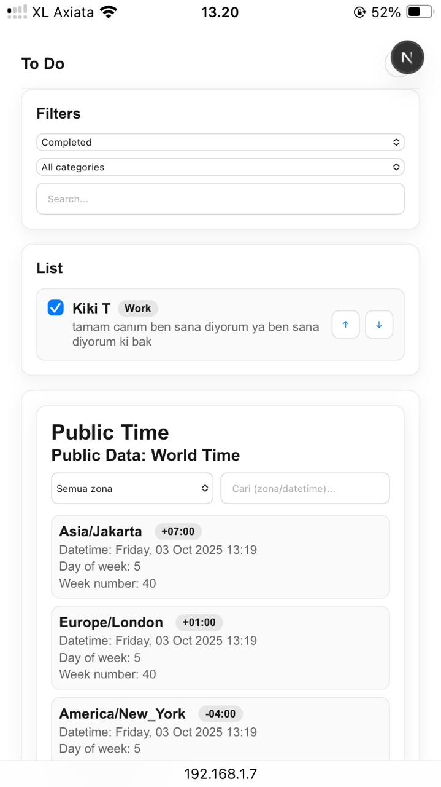
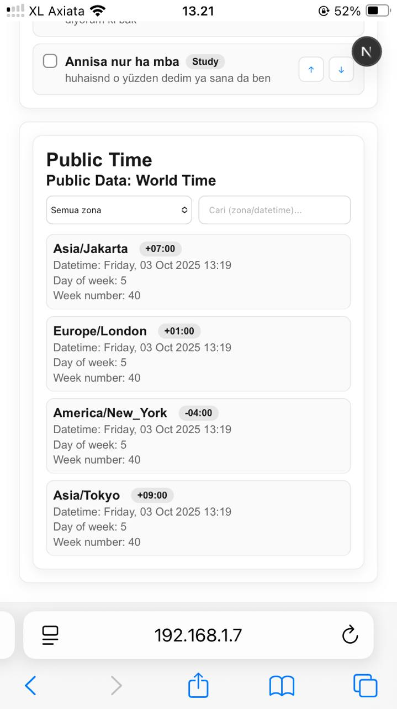

# Frontend Test for Developer

Aplikasi to‑do responsif dengan fitur tambah tugas, tandai selesai, filter status, pencarian, dan pengurutan sederhana. Dibangun dengan React + Redux Toolkit dan dijalankan dalam Next.js (App Router). Tidak ada data eksternal ataupun kolom kategori.

## Fitur
- Tambah to‑do (nama + deskripsi).
- Tandai to‑do sebagai selesai/aktif.
- Filter berdasarkan status (All/Active/Completed).
- Pencarian teks (nama/deskripsi).
- Pengurutan daftar dengan tombol naik/turun.
- Desain responsif dan modern (tema gelap/terang mengikuti sistem).

## Teknologi
- React + TypeScript
- Redux Toolkit (state management)
- Next.js (host runtime; halaman utama merender React App sebagai Client Component)
- CSS modular (`globals.css` + `src/styles/todo.css`)

## Struktur Proyek
- `src/App.tsx` — root UI aplikasi (Client Component).
- `src/app/page.tsx` — entry Next.js, merender `MainApp` dari `src/main.tsx`.
- `src/main.tsx` — komponen `MainApp` (Provider + store + App).
- `src/components/*` — komponen UI (AddTodoForm, FiltersBar, TodoList).
- `src/features/todos/*` — Redux slice dan saga (saga saat ini no‑op).
- `src/store/index.ts` — konfigurasi store.
- `src/styles/todo.css` — gaya responsif & modern.

## Menjalankan (Development)
```bash
npm run dev
```
Buka `http://localhost:3000`.

## Build Produksi
```bash
npm run build
```

## Start Produksi (preview)
```bash
npm run start
```

## Cara Pakai
1. Tekan ikon `＋` pada top bar untuk membuka layar “Add New”.
2. Isi `Name` dan `Description`, klik `Add` atau `Done` di top bar untuk menambahkan.
3. Gunakan filter status dan search untuk menyaring daftar.
4. Gunakan tombol `↑` dan `↓` pada item untuk mengurutkan.

## Catatan Desain
- Layout mengikuti sketsa: layar daftar dengan tombol `＋`, layar “Add New” dengan tombol `Done`/`Back`.
- Style utama ada di `src/styles/todo.css`; warna mengikuti variabel di `src/app/globals.css`.

## Pengembangan Lanjutan (Opsional)
- Ganti pengurutan tombol `↑/↓` ke drag‑and‑drop dengan `@dnd-kit/core`.
- Tambah penyimpanan lokal (`localStorage`) agar data tetap ada saat reload.

## Preview
<p align="center">
  
</p>

### More Screens
<p align="center">
  
  
</p>
<p align="center">
  
  
</p>
